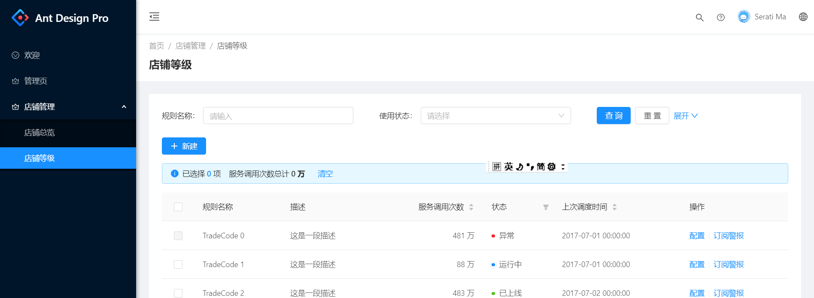

# 案例类型- 列表页与编辑页


# 1 开发规划

假设要开发一个下面的后台系统，编写店铺管理下的：`等级列表`与`等级编辑`。


# 2 生成页面

可以利用工具生成页面，或者你从其他相应模块中复制一个页面。或者你自己写一个全新的页面。

## 2.1 目录规划

三级模块就不再往下细分了。不然目录太多  

```shell
├── pages
│   ├── shop                       #一级模块
│   │   ├── shopOverall            #二级模块
│   │   │   ├── shopList           店铺一览
│   │   │   ├── applyOpen          申请开店 
│   │   │   ├── applyRenew         申请续费 
│   │   │   ├── applyCategory      申请类目
│   │   ├── shopLevel            
│   │   │   ├── levelList          店铺等级一览
│   │   │   ├── editLevel          编辑店铺等级
```


## 2.2 生成页面

这里使用UMI工具生成页面


### ① 生成等级列表页

> 选择查询表格


> 输入路径与文件名

路径：/shop/shopLevel

文件夹：/shop/shopLevel/levelList


### ② 生成等级编辑页

选择模板`基础表单页面`

路径：/shop/shopLevel/editLevel

文件夹：/shop/shopLevel/editLevel


## 2.3 修改菜单

追加下面的菜单，其中店铺等级做为第三级菜单不显示`hideChildrenInMenu`

```tsx
            {
              path: '/shop',
              icon: 'crown',
              name: 'shop',
              routes: [
                //商品总览页面
                {
                  name: 'shopoverall',
                  path: '/shop/shopoverall/',
                  component: './shop/shopOverall/shopList',
                },
                // 等级列表页面
                {
                  name: 'shoplevel',
                  path: '/shop/shoplevel/',
                  component: './shop/shopLevel/levelList',
                },
                // 编辑商品等级页面
                {
                  hideInMenu: true,
                  // name: 'editlevel',
                  path: '/shop/shoplevel/editlevel',
                  component: './shop/shopLevel/editLevel',
                },
              ],
            },
```

> 由于菜单启动了多语言，所以要修改 menu.ts

```typescript
export default {
  .....................  
  'menu.shop': '店铺管理',
  'menu.shop.shopoverall': '店铺总览',
  'menu.shop.shoplevel': '店铺等级',
  'menu.shop.shoplevel.editlevel': '编辑店铺等级',
}    
```


> 显示出基本的菜单




# 3 撰写等级一览

在 Ant Design Pro 中，一个完整的前端 UI 交互到服务端处理流程是这样的：

1. UI 组件交互操作；
2. 调用 model 的 effect；
3. 调用统一管理的 service 请求函数；
4. 使用封装的 request.ts 发送请求；
5. 获取服务端返回；
6. 然后调用 reducer 改变 state；
7. 更新 model。


## 3.1 代码分析

下面是生成的目录，红色框的区域是列表页的内容。


看这个代码也是有技巧的，需要按照顺序来看：

| 名称                                                         | 说明               | 备注                                                         |
| ------------------------------------------------------------ | ------------------ | ------------------------------------------------------------ |
| [data.d.ts](test-temp/src/pages/shop/shopLevel/data.d.ts)    | ts数据类型的定义。 | 定义了每行、分页、表格数据、以及表格查询的数据类型           |
| [_mock.ts](test-temp/src/pages/shop/shopLevel/_mock.ts)      | 模拟测试数据       | 定义了一个数组，模拟了数据源。定义了一个查询函数与一个提交函数 |
| [service.ts](test-temp/src/pages/shop/shopLevel/service.ts)  | service层          | 定义了添加、删除、修改、查询4个函数。                        |
| [model.ts](test-temp/src/pages/shop/shopLevel/levelList/model.ts) | model层            | 定义了Model框架，定义了实现方式。哈哈引入了ts后，增加了很多代码。 |
| [index.tsx](test-temp/src/pages/shop/shopLevel/levelList/index.tsx) | 展示层             | 包含了页面中的代码                                           |
| [style.less](test-temp/src/pages/shop/shopLevel/levelList/style.less) | 样式文件           |                                                              |
| [components](test-temp/src/pages/shop/shopLevel/levelList/components) | 组件目录           | table组件与增加和删除组件窗口。                              |

是否引入typescript一直有疑问，原先写js时，刚觉很奔放，突然加了这么多代码与约束，刚开始接收不了，只能先适应适应了。


## 3.2 编写data.d

定了数据结构，这个文件，被后面所有的文件引用。详细内容见：[data.d.ts](test-temp/src/pages/shop/shopLevel/levelList/data.d.ts)

### ① 定义每行记录数据结构

代码应该从数据库中自动得到。

> 引用的地方：

- _mock.ts  定义了一个检索的返回数据
- index.tsx  在定义columns中使用。


### ② 定义分页数据结构

这个应该是通用的数据结构，不应该重复撰写

> 引用的地方：

- index.tsx  在表格被改变时，使用。


### ③ 将①+②组合成表的数据结构

> 引用的地方：

- 被model使用。


### ④ 定义页面检索的数据结构

> 引用的地方：

- 被service使用，当作查询函数的参数
- 被index使用，用来使用查询参数


## 3.3 编写mock

修改[_mock.ts](test-temp/src/pages/shop/shopLevel/_mock.ts)文件，并做连个函数，分别是查询与保存。

如果这么模拟数据会被其他模块引用，可以放置到不同目录中。

- 放在上一级目录中，会被下级所有子目录引用。
- 放在根目录中的`mock`目录中，会被所有的引用。


## 3.4 编写service

为了方便管理维护，统一的请求处理都放在 `services` 文件夹中，并且一般按照 model 维度进行拆分文件。

当然，按照模块来进行编码时，可以先放到自己的模块中，最后汇总在一起后，统一管理。

这里模拟的4个函数，在列表页，只用到了前两个函数。

- queryShopLevel
- queryShopLevelById
- deleteShopLevel
- updateShopLevel


## 3.5 编写model

> 编写[model.ts](test-temp/src/pages/shop/shopLevel/levelList/model.ts)要注意几个内容。

- model的`namespace`很重要
  - 因为在整个系统中，model是通用的，最终要通过`namespace`来进行区分调用。
- model可以调用多个`service`


> 编写model的思路


### ① 定义model接口

定义`effects`方法，`reducers`方法，`state`与`namespace`

```typescript
export interface ModelType {
  namespace: string;
  state: StateType;
  effects: {
    fetch: Effect;
    add: Effect;
    remove: Effect;
    update: Effect;
  };
  reducers: {
    save: Reducer<StateType>;
  };
}
```


### ② 定义state接口

之将与`服务器的数据`或者`全局`的数据放入到`model`中。 其他如果是页面上的数据，可以放到页面中。

> 例如：

```
1:要查询的数据库信息，全部放到model中。
2：页面上例如：检索条件，判断是否显示弹出层等。
```


### ③ 定义Effect接口

基本上是一个通用的代码格式。


### ④ 实现Model

按照标准的业务逻辑实现。

最后要`export default Model;`


## 3.6 编写index

`index.tsx`是当前页面的显示逻辑。

### ① import必要组件

- react
- redux
- dva
- antd相关组件
- model
- less 样式文件


### ② 定义Props接口

定义了`FormComponentProps`属性

这个很重要，如果名字错了，得不到数据。

```jsx
interface PageProps extends FormComponentProps {
  dispatch: Dispatch<
    Action<
      | 'shopLevelList/add'
      | 'shopLevelList/fetch'
      | 'shopLevelList/remove'
      | 'shopLevelList/update'
      >
    >;
  loading: boolean;
  shopLevelList: StateType;
}
```


### ③ 定义State接口

定义页面自己的state接口。 如果是与数据库相关的接口，都被Model层接管了。

这个state主要是为了保存查询条件

### ④ 定义connect

可以连接多个model，只用名字起的不一样就可以了。

解读一下，下面的代码通过connect传入一个`mapStateToProps`，也就是将model中的state转入到props

```tsx
@connec
  ({
     shopLevelList,
     loading,
   }: {
    shopLevelList: StateType;
    loading: {
      models: {
        [key: string]: boolean;
      };
    };
  }) => ({
    shopLevelList,
    loading: loading.models.shopLevelList,
  }),
)
```

[dva](https://dvajs.com/) 中关于connect的定义。

```typescript
/**
 * Connects a React component to Dva.
 */
export function connect(
  mapStateToProps?: Function,
  mapDispatchToProps?: Function,
  mergeProps?: Function,
  options?: Object
): Function;
```


### ⑤ 定义class类

1： 继承Component<PageProps, PageState>

2：定义state

3：定义columns，通过<T>得到了传入的数据类型

4：`componentDidMount` 加载数据

5：函数：定义表格事件被触发：例如 点击表头排序，点击表头筛选，点击分页控件，变更每页的数量

6：函数：重置查询条件，并重新查询

7：函数：检索

8：函数：用来生成检索区域窗口

9：函数：render生成整个页面

10：调用了`Form.create`函数。

11：跳转到编辑页面


# 4 撰写等级编辑

点击等级列表页的新增或者编辑后，会显示这个页面。


撰写这个页面，要完成这几步：

1：确定怎么从父窗口跳转过来。

2：确定用到的服务器端接口函数，或者模拟mock

3：编写service

4：编写model

5：编写UI


另外发现 mock  、 service 、data会被公用，所以把这些文件提到上一级目录。 model建议与每个页面放在一起


## 4.1 页面跳转

[prolayout的帮助说明](https://github.com/ant-design/ant-design-pro-layout/blob/master/README.zh-CN.md)

由于编辑页不在菜单上，所以需要跳转到新的页面中，这里要要解决下面的问题：

### ① 左侧菜单不变

- 放在同一级别
- 不显示
- 不设定name

```typescript
// 等级列表页面
{
  name: 'shoplevel',
  path: '/shop/shoplevel/',
  component: './shop/shopLevel/levelList',
},
// 编辑商品等级页面
{
  hideInMenu: true,
  // name: 'editlevel',
  path: '/shop/shoplevel/editlevel',
  component: './shop/shopLevel/editLevel',
},
```


### ② 向编辑页传参数

可以使用`router.push`或`Link`

```typescript
router.push('/shop/shoplevel/editLevel?sgId=0');

const goUrl = `/shop/shoplevel/editLevel?sgId=${record.sgId}`
<Link to={goUrl}>编辑</Link>
```


### ③ 编辑页返回功能

设置返回图标与返回的事件，如果少设置一个就不显示返回图标

```typescript
<PageHeaderWrapper title="新增店铺等级" backIcon={<Icon type="arrow-left" />} onBack={() => window.history.back()} >
```


### ④ 设定页面Title

```typescript
      <Helmet>
        <title>新增店铺等级</title>
        <meta name="description" content="新增店铺等级" />
      </Helmet>
```


## 4.2 撰写mock

在编辑页面，会用到两个函数，`getById` 与`update`函数。 

- 变更时，需要通过`getById`得到要变更的数据。
- `update`既包含了`insert`与`update`

详细代码见：[_mock.ts](test-temp/src/pages/shop/shopLevel/_mock.ts)

```typescript
  'GET /api/shop/queryShopLevelById': queryShopLevelById,
  'POST /api/shop/updateShopLevel': updateShopLevel,
```


## 4.3 编写service

编辑页面需要查询与更新函数

- queryShopLevelById
- updateShopLevel


## 4.4 编写model

建议一个页面一个model，这样便于维护。详细代码见：[_mock.ts](test-temp/src/pages/shop/shopLevel/editLevel/model.ts)

### ① 定义Effect接口

在使用effect文件时用到了。

### ②  定义StateType

定义这个页面用到的从服务器得到的state

```typescript
export interface StateType {
  // 点击提交按钮后的状态
  editResult?:EditResultType;
  // 从数据库检索出来的数据结构
  currentItem:ShopLevelItem;
}
```


### ③ 定义model接口

```typescript
export interface ModelType {
  namespace: string;
  state: StateType;
  effects: {
    queryShopLevelById: Effect;
    updateShopLevel: Effect;
    cleanCommitState: Effect;
  };
  reducers: {
    save: Reducer<StateType>;
  };
}
```


### ④ 实现model

有两个业务逻辑。

一、显示要编辑的数据，或者从数据库中得到，或者给一个初始化数据。

二、进行保存。 首先要提交到数据库。 后有两个结果。

​        正确的情况下：显示正确页面。

​		错误的情况下：显示错误页面。


里面有一个重要的，是要从request中得到服务器返回的错误信息。例如：

```json
{
    status: 500,
    error: 'Bad Request',
    message: '参数无效',
    code: 30101,
    path: '/result/exception',
    exception: 'com.wukong.core.exceptions.BusinessException',
    errors: {
        name: '长度需要在6和50之间',
        email: '不是一个合法的电子邮件地址',
    },
    timestamp: '2018-05-31T09:41:16.461+0000',
}    
```

如果保存后，会得到response，然后通过response的status判断是否有错误。

如果有错误，就根据`response.clone().text();`得到服务器返回的状态。

```typescript
    *updateShopLevel({ payload }, { call, put }) {
      const response = yield call(updateShopLevel, payload);
      let editResult:EditResultType = {
        ...defaultEditResult,
        isCommit: true,
      };
      if (response.status && response.status !== 200) {
        // 这里也可以使用：.json() ，但是要在界面中进行特殊处理
        const err:any = yield response.clone().text();
        editResult = {
          isCommit: true,
          isSuccess: false,
          errMessage: err,
        }
      }
      yield put({
        type: 'save',
        payload: {
          editResult,
        },
      });
    },
```


## 4.4 编写ui


### ① import必要组件

导入了一些必要的包。


### ② 定义Props接口

```typescript
interface EditLevelProps extends FormComponentProps {
  // 定义了数据加载的状态
  loading: boolean;
  // 定义了提交数据加载的状态
  submitting: boolean;
  // 定义了分发的函数
  dispatch: Dispatch<any>;
  // 从model类中得到的类型
  shopLevelEdit: StateType;
  // 从url中需要得到的类型
  location: {
    query: {
      sgId: number;
    };
  };
}

```


### ③ 定义State接口

这个页面没有自己定义的内容

### ④ 定义connect

由于使用了Form组件，所以这个connect会多写一行代码.

另外这个组件里面有两个状态符号。

```typescript
export default Form.create<EditLevelProps>()(
  connect(
    ({
       shopLevelEdit,
       loading,
    }: {
      shopLevelEdit: StateType;
      loading: {
          effects: {
            [key: string]: boolean;
          };
      };
    }) => ({
      shopLevelEdit,
      loading: loading.effects['shopLevelEdit/queryShopLevelById'],
      submitting: loading.effects['shopLevelEdit/updateShopLevel'],
  }))(EditLevel),
);
```


### ⑤ 定义class类


1：定义了页面props的数据结构

2：定义了类：继承了Component<EditLevelProps> 

3：第一次加载 componentDidMount函数

4：点击返回按钮 componentWillUnmount函数

5：点击提交按钮的事件 handleSubmit函数

6：根据id得到页面的title,新增或者编辑：getTitle函数

7：显示页面title renderTitle函数

8：显示form renderForm函数

9：显示提交结果 renderResult函数

10：整个页面的显示逻辑  render函数

11：Form.create与connect函数