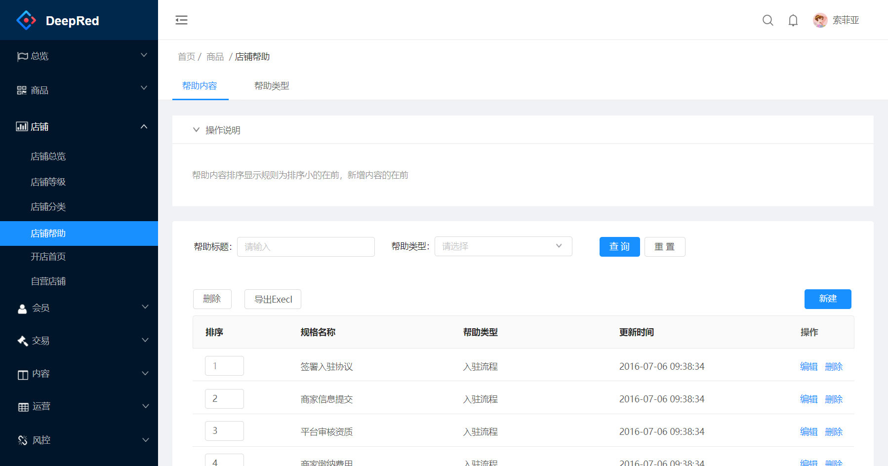
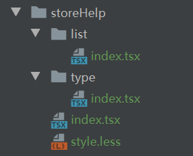
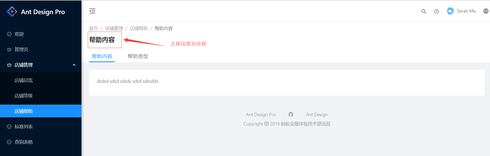

# 案例二 店铺帮助




# 1. 搭建框架

根据需求分析，是一个头部带Tab的页面。初步判读有两个页面。

## 第一步、撰写页面基本代码

先写一个代码让页面与菜单能显示出来。

其中`storeHelp/index.tsx` 是一个导航页面，这部分的代码比较通用。

list与type目录是点击tab后的业务页面，当前先简单输出一个hello




## 第二步、编写菜单

菜单需要隐藏`店铺帮助`下面的菜单。

点击这个标签后，直接跳转到第一个标签。

具体如下：

```js
// 店铺帮助
{
  name: 'storeHelp',
  path: '/store/storeHelp/',
  component: './store/storeHelp',
  hideChildrenInMenu: true,
  routes: [
    {
      path: '/store/storeHelp/',
      redirect: '/store/storeHelp/list',
    },
    {
      path: '/store/storeHelp/list',
      name: 'list',
      component: './store/storeHelp/list',
    },
    {
      path: '/store/storeHelp/type',
      name: 'type',
      component: './store/storeHelp/type',
    },
  ],
},
```


## 第三步、优化主界面

下图红框的地方太占地方了，是否可以将他去掉。由于使用了antd的组件，在这个组件里面没有去掉title的方法。

所以使用了**覆盖组件样式**的方法来实现。




[antdPro官方文档有说明](https://pro.ant.design/docs/style-cn)

```less
//覆盖组件样式
.customHeaderTitle {
  :global {
    .ant-page-header-heading {
      //height: 0;
      display: none;
    }
  }
}
```


# 2. 写帮助内容模块


## 第一步、撰写service层


###  ① 撰写data文件

这个名字建议根据模块名来建立，这样好区分。每一个表对应这么一个文件。例如：[helpData.d.ts](test-temp/src/pages/store/storeHelp/helpData.d.ts)

有下面的规律：

| 分类       | 例如              | 说明                                               |
| ---------- | ----------------- | -------------------------------------------------- |
| Item       | HelpItem          | 从help数据库结构得到                               |
| 分页       | Pagination        | 所有的页面这个都一样，可以做成公用                 |
| List       | HelpListData      | help用于列表显示的数据集                           |
| 查询的条件 | HelpListParams    | 有业务相关的，也有固定的。这个需要根据实际情况修改 |
| 删除的条件 | HelpTypeDelParams | 默认有两个按照关键字删除，删除关键字列表           |


### ② 撰写_mock文件

名字一定要是_mock，模拟了4个函数，分别是：查一个、查多个、删除一个或多个、追加或更新。

有下面的规律：

| 分类      | 具体名称           | 说明                             |
| --------- | ------------------ | -------------------------------- |
| 变量      | helpListDataSource | 定义一个数组                     |
| 循环      | 模拟30个help       | 今后这个做成通用函数             |
| queryById | queryHelpById      | 查询一条记录                     |
| query     | queryHelp          | 查询所有的，可以带分页           |
| update    | updateHelp         | 根据主键，进行增加或变更         |
| delete    | deleteHelp         | 可以根据一个Id或者多个Id进行删除 |


### ③ 撰写service文件

有下面的规律：添加、删除、修改、查询这4中类型的函数

| 分类      | 具体名称      | 说明                             |
| --------- | ------------- | -------------------------------- |
| queryById | queryHelpById | 查询一条记录                     |
| query     | queryHelp     | 查询所有的，可以带分页           |
| update    | updateHelp    | 根据主键，进行增加或变更         |
| delete    | deleteHelp    | 可以根据一个Id或者多个Id进行删除 |


### ④ 撰写listModel文件

这个文件，只有两个函数，用来查询一个列表或者删除一个或多个文件。

| 名称                | 说明                         |
| ------------------- | ---------------------------- |
| 定义State接口       |                              |
| 定义Effect接口      | 所有的model 都一样           |
| 定义Model接口       | 定义model的整体结构          |
| 实现Model-namespace | 这个要唯一                   |
| 实现Model-state     | 初始化值                     |
| 实现Model-effects   | 有两个函数：fetch  、 remove |
| 实现Model-reducers  | 主要是更新List               |
|                     |                              |


### ⑤ 撰写editModel文件


## 第二步、撰写view层


### ①  Help组件

操作说明这个组件用到的地方比较多，另外系统默认的`collapse 折叠面板`样式还需要调整，所以做一个固定的组件。[组件代码](test-temp/src/components/Wk/PageHelp/index.tsx)

主要修改的工作如下：

1、组件可以传入`header（可选）`与`children`，用来显示标题与内容。

2、取消原有组件的边框

3、下面的元素与本元素间隔`23px`间隔

4、帮助正文的字体颜色为45%

```less
@import '~antd/es/style/themes/default.less';
//覆盖组件样式Collapse折叠面板,取消边框
.customCollapse {
  margin-bottom: 23px;
  border: 0;
  :global {
    .ant-collapse-content {
      color: @text-color-secondary;
      border: 0;
    }
    .ant-collapse-item {
      border: 0;
    }
  };
}
```


