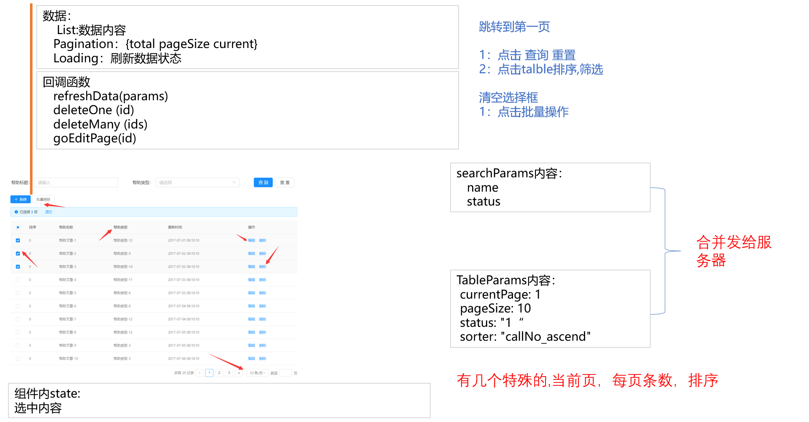
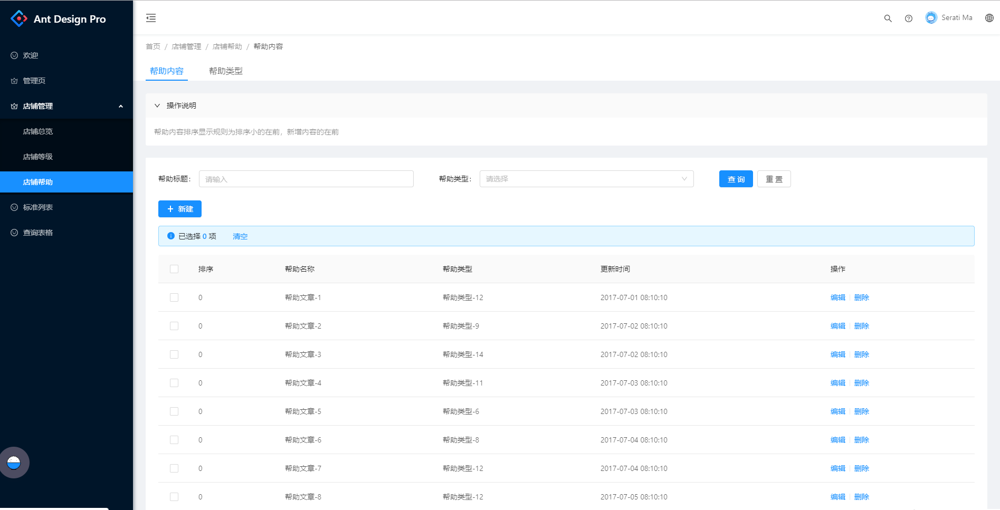

# 案例二 店铺帮助


# 1. 搭建框架

根据需求分析，是一个头部带Tab的页面。初步判读有两个页面。

## 第一步、撰写页面基本代码

先写一个代码让页面与菜单能显示出来。

其中`storeHelp/index.tsx` 是一个导航页面，这部分的代码比较通用。

list与type目录是点击tab后的业务页面，当前先简单输出一个hello


## 第二步、编写菜单

菜单需要隐藏`店铺帮助`下面的菜单。

点击这个标签后，直接跳转到第一个标签。

具体如下：

```js
// 店铺帮助
{
  name: 'storeHelp',
  path: '/store/storeHelp/',
  component: './store/storeHelp',
  hideChildrenInMenu: true,
  routes: [
    {
      path: '/store/storeHelp/',
      redirect: '/store/storeHelp/list',
    },
    {
      path: '/store/storeHelp/list',
      name: 'list',
      component: './store/storeHelp/list',
    },
    {
      path: '/store/storeHelp/type',
      name: 'type',
      component: './store/storeHelp/type',
    },
  ],
},
```


## 第三步、优化主界面

下图红框的地方太占地方了，是否可以将他去掉。由于使用了antd的组件，在这个组件里面没有去掉title的方法。

所以使用了**覆盖组件样式**的方法来实现。


[antdPro官方文档有说明](https://pro.ant.design/docs/style-cn)

```less
//覆盖组件样式
.customHeaderTitle {
  :global {
    .ant-page-header-heading {
      //height: 0;
      display: none;
    }
  }
}
```


# 2. 写帮助内容模块


## 第一步、撰写数据层


###  ① 撰写data文件

这个名字建议根据模块名来建立，这样好区分。每一个表对应这么一个文件。例如：[data.d.ts](test-temp/src/pages/store/storeHelp/list/data.d.ts)

有下面的规律：

| 分类       | 例如           | 说明                                               |
| ---------- | -------------- | -------------------------------------------------- |
| Item       | HelpItem       | 从help数据库结构得到                               |
| 分页       | Pagination     | 所有的页面这个都一样，可以做成公用                 |
| 查询的条件 | HelpListParams | 有业务相关的，也有固定的。这个需要根据实际情况修改 |


### ② 撰写_mock文件

名字一定要是_mock，模拟了4个函数，分别是：查一个、查多个、删除一个或多个、追加或更新。

有下面的规律：

| 分类      | 具体名称           | 说明                     |
| --------- | ------------------ | ------------------------ |
| 变量      | helpListDataSource | 定义一个数组             |
| 循环      | 模拟30个help       | 今后这个做成通用函数     |
| queryById | queryHelpById      | 查询一条记录             |
| query     | queryHelp          | 查询所有的，可以带分页   |
| update    | updateHelp         | 根据主键，进行增加或变更 |
| delete    | deleteOneHelp      | 可以根据一个Id进行删除   |
| delete    | deleteManyHelp     | 可以根据多个Id进行删除   |


### ③ 撰写service文件

有下面的规律：添加、删除、修改、查询这4中类型的函数

| 分类      | 具体名称       | 说明                     |
| --------- | -------------- | ------------------------ |
| queryById | queryHelpById  | 查询一条记录             |
| query     | queryHelp      | 查询所有的，可以带分页   |
| update    | updateHelp     | 根据主键，进行增加或变更 |
| delete    | deleteOneHelp  | 可以根据一个Id进行删除   |
| delete    | deleteManyHelp | 可以根据多个Id进行删除   |


### ④ 撰写model文件

在子目录中的moel文件名只能是model，不然系统无法识别。很多人对model也有诟病，认为在一个简单的系统中，model也就是redux影响了执行的速度。

| 名称                | 说明                                        |
| ------------------- | ------------------------------------------- |
| 定义State接口       |                                             |
| 定义Effect接口      | 所有的model 都一样                          |
| 定义Model接口       | 定义model的整体结构                         |
| 实现Model-namespace | 这个要唯一                                  |
| 实现Model-state     | 初始化值                                    |
| 实现Model-effects   | 有两个函数：fetch  、 deleteOne、deleteMany |
| 实现Model-reducers  | 主要是更新List                              |
|                     |                                             |


## 第二步、撰写展示层

按照下图，将整个界面分成三部分：

* 操作说明
* 检索区域
* 表格区域


### ①  父页面

负责从model层获取数据，并将引用`操作说明`、`检索框`、`列表框`


### ② Help组件

操作说明这个组件用到的地方比较多，另外系统默认的`collapse 折叠面板`样式还需要调整，所以做一个固定的组件。[组件代码](test-temp/src/components/Wk/PageHelp/index.tsx)

主要修改的工作如下：

1、组件可以传入`header（可选）`与`children`，用来显示标题与内容。

2、取消原有组件的边框

3、下面的元素与本元素间隔`23px`间隔

4、帮助正文的字体颜色为45%

```less
@import '~antd/es/style/themes/default.less';
//覆盖组件样式Collapse折叠面板,取消边框
.customCollapse {
  margin-bottom: 23px;
  border: 0;
  :global {
    .ant-collapse-content {
      color: @text-color-secondary;
      border: 0;
    }
    .ant-collapse-item {
      border: 0;
    }
  };
}
```


### ③ 检索区域

组件使用说明：

| 名称             | 说明                                       |
| ---------------- | ------------------------------------------ |
| helpTypeList     | 帮助类型下拉框数据。类型是：HelpTypeItem[] |
| handleFormSearch | 父窗口的回调函数                           |
|                  |                                            |

回调函数中会传出来检索框的查询条件，然后根据查询条件，匹配Table控件的数据进行检索。


### ④ 列表区域

这个区域比较复杂，需要传入数据与回调函数。




组件使用说明：

| 名称                  | 说明                                       |
| --------------------- | ------------------------------------------ |
| helpTypeList          | 帮助类型下拉框数据。类型是：HelpTypeItem[] |
| helpList              | 帮助文档数据HelpItem[]                     |
| loading               | 帮助文档检索框                             |
| pagination?           | Partial<Pagination>                        |
| handleTableRefresh    | (params:Partial<HelpListParams>) => void   |
| handleTableDelOne     | (id:number) => void                        |
| handleTableDelMany    | (ids:string) => void                       |
| handleTableGoEditPage | (id:number) => void                        |




