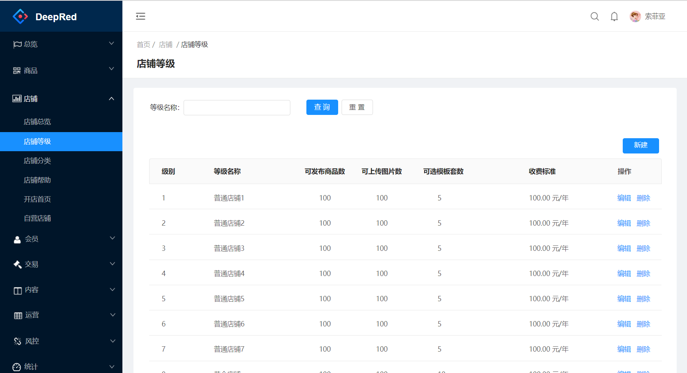
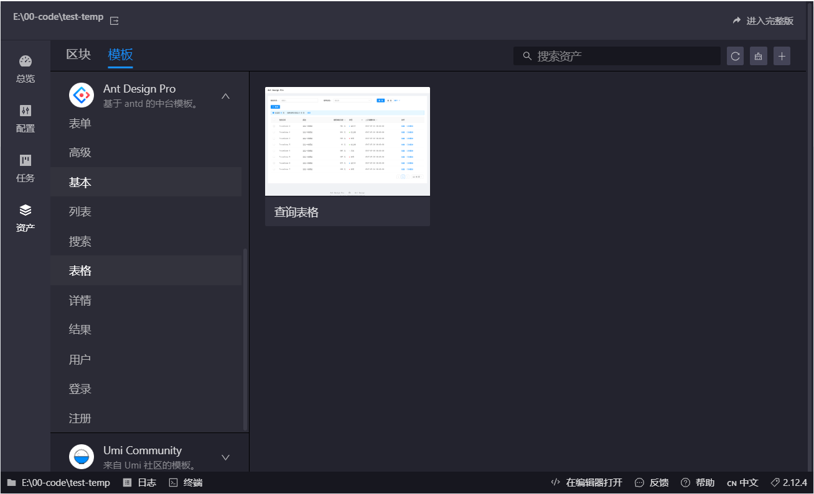
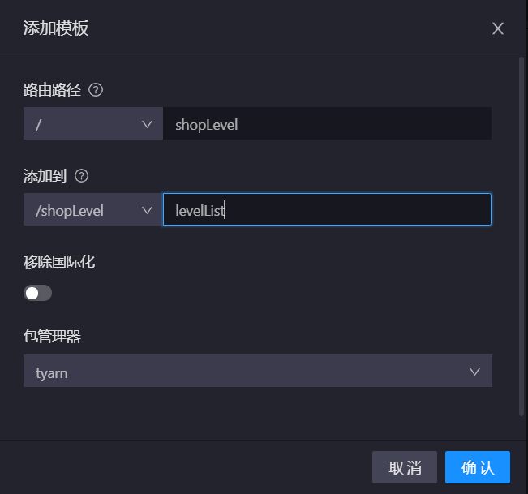
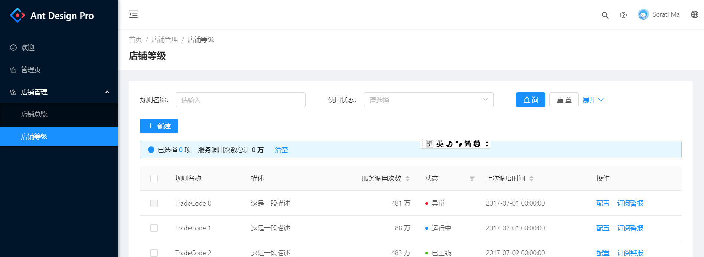
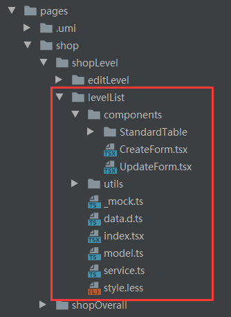

# 开始使用

https://pro.ant.design/docs/getting-started-cn


# 1. 搭建环境


## 1.1 安装tyarn

如果网络状况不佳，可以使用 [tyarn](https://www.npmjs.com/package/tyarn) 进行加速。

```shell
npm install yarn tyarn -g
```

在执行`tyarn`的时候，可能出现提示脚本不能执行，请右键点击开始菜单，在弹出管理员powerShell中输入：

```shell
set-ExecutionPolicy RemoteSigned  
```


## 1.2 初始化代码

```shell
# 选择 ant-design-pro
tyarn create umi
# 这一步执行后，需要安装995M的插件，建议下载后，本地打个zip包，备份一下，下次不用重新操作了。
tyarn install
tyarn start 
```

启动完成后会自动打开浏览器访问 [http://localhost:8000](http://localhost:8000/)，你看到下面的页面就代表成功了。

下面是标准的页面：

```shell
├── config                   # umi 配置，包含路由，构建等配置
├── mock                     # 本地模拟数据
├── public
│   └── favicon.png          # Favicon
├── src
│   ├── assets               # 本地静态资源
│   ├── components           # 业务通用组件
│   ├── e2e                  # 集成测试用例
│   ├── layouts              # 通用布局
│   ├── models               # 全局 dva model
│   ├── pages                # 业务页面入口和常用模板
│   ├── services             # 后台接口服务
│   ├── utils                # 工具库
│   ├── locales              # 国际化资源
│   ├── global.less          # 全局样式
│   └── global.ts            # 全局 JS
├── tests                    # 测试工具
├── README.md
└── package.json
```


## 1.3 下载代码看看

如果速度缓慢，可以尝试升级 umi 版本到最新，并在 config.ts 设置 block.defaultGitUrl 为 'https://gitee.com/ant-design/pro-blocks'。


# 2. 开发


## 2.1 开发计划

假设要开发一个下面的后台系统，编写店铺管理下的：`等级列表`与`等级编辑`。




## 2.2 生成页面

可以利用工具生成页面，或者你从其他相应模块中复制一个页面。或者你自己写一个全新的页面。

### 2.2.1 目录规划

三级模块就不再往下细分了。不然目录太多  

```shell
├── pages
│   ├── shop                       #一级模块
│   │   ├── shopOverall            #二级模块
│   │   │   ├── shopList           店铺一览
│   │   │   ├── applyOpen          申请开店 
│   │   │   ├── applyRenew         申请续费 
│   │   │   ├── applyCategory      申请类目
│   │   ├── shopLevel            
│   │   │   ├── levelList          店铺等级一览
│   │   │   ├── editLevel          编辑店铺等级
```


### 2.2.2 生成页面

这里使用UMI工具生成页面


#### ① 生成等级列表页

> 选择查询表格




> 输入路径与文件名

路径：/shop/shopLevel

文件夹：/shop/shopLevel/levelList




#### ② 生成等级编辑页

选择模板`基础表单页面`

路径：/shop/shopLevel/editLevel

文件夹：/shop/shopLevel/editLevel


### 2.2.3 修改菜单

追加下面的菜单，其中店铺等级做为第三级菜单不显示`hideChildrenInMenu`

```tsx
            {
              path: '/shop',
              icon: 'crown',
              name: 'shop',
              routes: [
                {
                  name: 'shopoverall',
                  path: '/shop/shopoverall/',
                  component: './shop/shopOverall/shopList',
                },
                {
                  name: 'shoplevel',
                  path: '/shop/shoplevel',
                  component: './shop/shopLevel/levelList',
                  hideChildrenInMenu: true,
                  routes: [
                    {
                      name: 'editlevel',
                      path: '/shop/shoplevel/editlevel',
                      component: './shop/shopLevel/editLevel',
                    },
                  ],
                },
              ],
            },
```

> 由于菜单启动了多语言，所以要修改 menu.ts

```typescript
export default {
  .....................  
  'menu.shop': '店铺管理',
  'menu.shop.shopoverall': '店铺总览',
  'menu.shop.shoplevel': '店铺等级',
  'menu.shop.shoplevel.editlevel': '编辑店铺等级',
}    
```


> 显示出基本的菜单




## 2.3 撰写等级一览

在 Ant Design Pro 中，一个完整的前端 UI 交互到服务端处理流程是这样的：

1. UI 组件交互操作；
2. 调用 model 的 effect；
3. 调用统一管理的 service 请求函数；
4. 使用封装的 request.ts 发送请求；
5. 获取服务端返回；
6. 然后调用 reducer 改变 state；
7. 更新 model。


### 2.3.1 代码分析

下面是生成的目录，红色框的区域是列表页的内容。




看这个代码也是有技巧的，需要按照顺序来看：

| 名称       | 说明               | 备注                                                         |
| ---------- | ------------------ | ------------------------------------------------------------ |
| [data.d.ts](test-temp/src/pages/shop/shopLevel/levelList/data.d.ts)  | ts数据类型的定义。 | 定义了每行、分页、表格数据、以及表格查询的数据类型           |
| [_mock.ts](test-temp/src/pages/shop/shopLevel/levelList/_mock.ts)  | 模拟测试数据       | 定义了一个数组，模拟了数据源。定义了一个查询函数与一个提交函数 |
| [service.ts](test-temp/src/pages/shop/shopLevel/levelList/service.ts) | service层          | 定义了添加、删除、修改、查询4个函数。                        |
| [model.ts](test-temp/src/pages/shop/shopLevel/levelList/model.ts)   | model层            | 定义了Model框架，定义了实现方式。哈哈引入了ts后，增加了很多代码。 |
| [index.tsx](test-temp/src/pages/shop/shopLevel/levelList/index.tsx)  | 展示层             | 包含了页面中的代码                                           |
| [style.less](test-temp/src/pages/shop/shopLevel/levelList/style.less) | 样式文件           |                                                              |
| [components](test-temp/src/pages/shop/shopLevel/levelList/components) | 组件目录           | table组件与增加和删除组件窗口。                              |

是否引入typescript一直有疑问，原先写js时，刚觉很奔放，突然加了这么多代码与约束，刚开始接收不了，只能先适应适应了。


### 2.3.2 编写data.d

定了数据结构，这个文件，被后面所有的文件引用。详细内容见：[data.d.ts](test-temp/src/pages/shop/shopLevel/levelList/data.d.ts)

#### ① 定义每行记录数据结构

代码应该从数据库中自动得到。

> 引用的地方：

* _mock.ts  定义了一个检索的返回数据
* index.tsx  在定义columns中使用。


#### ② 定义分页数据结构

这个应该是通用的数据结构，不应该重复撰写

> 引用的地方：

- index.tsx  在表格被改变时，使用。


#### ③ 将①+②组合成表的数据结构

> 引用的地方：

- 被model使用。


#### ④ 定义页面检索的数据结构

> 引用的地方：

- 被service使用，当作查询函数的参数
- 被index使用，用来使用查询参数


### 2.3.3 编写mock

修改[_mock.ts](test-temp/src/pages/shop/shopLevel/levelList/_mock.ts)文件，并做连个函数，分别是查询与保存。

如果这么模拟数据会被其他模块引用，可以放置到不同目录中。

* 放在上一级目录中，会被下级所有子目录引用。
* 放在根目录中的`mock`目录中，会被所有的引用。


### 2.3.4 编写service

为了方便管理维护，统一的请求处理都放在 `services` 文件夹中，并且一般按照 model 维度进行拆分文件。

当然，按照模块来进行编码时，可以先放到自己的模块中，最后汇总在一起后，统一管理。

这里模拟的4个函数：

* queryShopLevel
* removeShopLevel
* addShopLevel
* updateShopLevel


### 2.3.5 编写model

>  编写[model.ts](test-temp/src/pages/shop/shopLevel/levelList/model.ts)要注意几个内容。

* model的`namespace`很重要
  * 因为在整个系统中，model是通用的，最终要通过`namespace`来进行区分调用。
* model可以调用多个`service`


> 编写model的思路


#### ① 定义model接口

定义`effects`方法，`reducers`方法，`state`与`namespace`

```typescript
export interface ModelType {
  namespace: string;
  state: StateType;
  effects: {
    fetch: Effect;
    add: Effect;
    remove: Effect;
    update: Effect;
  };
  reducers: {
    save: Reducer<StateType>;
  };
}
```


#### ② 定义state接口

之将与`服务器的数据`或者`全局`的数据放入到`model`中。 其他如果是页面上的数据，可以放到页面中。

> 例如：

```
1:要查询的数据库信息，全部放到model中。
2：页面上例如：检索条件，判断是否显示弹出层等。
```


#### ③ 定义Effect接口

基本上是一个通用的代码格式。


#### ④ 实现Model

按照标准的业务逻辑实现。

最后要`export default Model;`


### 2.3.6 编写index

`index.tsx`是当前页面的显示逻辑。

#### ① import必要组件

* react
* redux
* dva
* antd相关组件
* model
* less 样式文件


#### ② 定义Props接口

定义了`FormComponentProps`属性

这个很重要，如果名字错了，得不到数据。

```jsx
interface PageProps extends FormComponentProps {
  dispatch: Dispatch<
    Action<
      | 'shopLevelList/add'
      | 'shopLevelList/fetch'
      | 'shopLevelList/remove'
      | 'shopLevelList/update'
      >
    >;
  loading: boolean;
  shopLevelList: StateType;
}
```


#### ③ 定义State接口

定义页面自己的state接口。 如果是与数据库相关的接口，都被Model层接管了。


#### ④ 定义connect

可以连接多个model，只用名字起的不一样就可以了。

解读一下，下面的代码通过connect传入一个`mapStateToProps`，也就是将model中的state转入到props

```tsx
@connec
  ({
     shopLevelList,
     loading,
   }: {
    shopLevelList: StateType;
    loading: {
      models: {
        [key: string]: boolean;
      };
    };
  }) => ({
    shopLevelList,
    loading: loading.models.shopLevelList,
  }),
)
```

[dva](https://dvajs.com/) 中关于connect的定义。

```typescript
/**
 * Connects a React component to Dva.
 */
export function connect(
  mapStateToProps?: Function,
  mapDispatchToProps?: Function,
  mergeProps?: Function,
  options?: Object
): Function;
```


#### ⑤ 定义class类

1： 继承Component<PageProps, PageState>

2：定义state

3：定义columns，通过<T>得到了传入的数据类型

4：`componentDidMount` 加载数据

5：函数：定义表格事件被触发：例如 点击表头排序，点击表头筛选，点击分页控件，变更每页的数量

6：函数：重置查询条件，并重新查询

7：函数：检索

8：函数：用来生成检索区域窗口

9：函数：render生成整个页面

10：调用了`Form.create`函数。


## 2.4 撰写等级编辑

①②③④⑤⑥⑦⑧