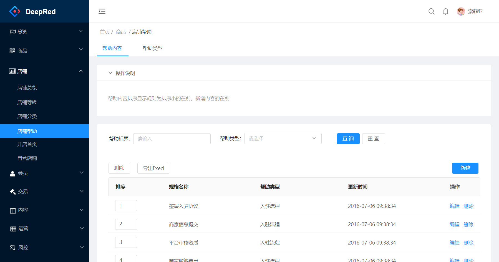

# 开始使用

https://pro.ant.design/docs/getting-started-cn


# 1. 搭建环境


## 1.1 安装tyarn

如果网络状况不佳，可以使用 [tyarn](https://www.npmjs.com/package/tyarn) 进行加速。

```shell
npm install yarn tyarn -g
```

在执行`tyarn`的时候，可能出现提示脚本不能执行，请右键点击开始菜单，在弹出管理员powerShell中输入：

```shell
set-ExecutionPolicy RemoteSigned  
```


## 1.2 初始化代码

```shell
# 选择 ant-design-pro
tyarn create umi
# 这一步执行后，需要安装995M的插件，建议下载后，本地打个zip包，备份一下，下次不用重新操作了。
tyarn install
tyarn start 
```

启动完成后会自动打开浏览器访问 [http://localhost:8000](http://localhost:8000/)，你看到下面的页面就代表成功了。

下面是标准的页面：

```shell
├── config                   # umi 配置，包含路由，构建等配置
├── mock                     # 本地模拟数据
├── public
│   └── favicon.png          # Favicon
├── src
│   ├── assets               # 本地静态资源
│   ├── components           # 业务通用组件
│   ├── e2e                  # 集成测试用例
│   ├── layouts              # 通用布局
│   ├── models               # 全局 dva model
│   ├── pages                # 业务页面入口和常用模板
│   ├── services             # 后台接口服务
│   ├── utils                # 工具库
│   ├── locales              # 国际化资源
│   ├── global.less          # 全局样式
│   └── global.ts            # 全局 JS
├── tests                    # 测试工具
├── README.md
└── package.json
```


## 1.3 解决ProDemo下载慢

如果速度缓慢，可以尝试升级 umi 版本到最新，并在 config.ts 设置 block.defaultGitUrl 为 'https://gitee.com/ant-design/pro-blocks'。


# 2. 案例一

店铺等级编辑功能。[案例一的详细说明文档](antdpro-example-01.md)

## 2.1 服务器交互功能

* 点击左侧菜单，显示店铺等级一览。
  * 查询功能
    * 可以按照检索条件(名称)查询
    * 可以分页
    * 可以排序
  * 删除功能
    * 删除某个指定记录
* 点击`新建`或者`编辑`按钮，跳转到编辑页面
  * 从数据库中查询一条记录，并显示在编辑页面中
  * 将编辑页面提交的信息，提交给服务器


## 2.2 列表页功能细节

* 在加载或检索数据时，有loading图标。


## 2.3 编辑页功能细节

- 在页面加载时，有loading图标
- 在提交服务器保存时时，有loading图标
- 如果出现错误，会将服务器的错误提示显示在错误提示页面。


## 2.4 遇到的难点


###  2.4.1 列表页

* 如何解决列表页与编辑页之间跳转的问题。
  * 怎么将参数传递给编辑页。
  * 怎么让编辑页显示出来，但是左侧菜单不变。

* 在connect方面耽误了点时间。注意名字不能写错。

### 2.4.2 编辑页

#### ① mock 层

* 如何模拟返回错误数据，将http的status设置成不等于200
* 从Request中获得参数，例如Id，要进行强制转换，不然通过typeof看，是string类型。
* 如何模拟服务器3秒钟才能返回消息。

#### ② service层

没有难点

#### ③ model层

* 服务器返回的错误，如何得到错误的详细信息。[可以见这个网址](https://github.com/ant-design/ant-design-pro/issues/5722)

  * 难点在如何将`respone.clone().text()`这个异步函数，变成阻塞同步函数。


#### ④ UI 层

* 如何有两个状态，加载状态与提交状态。
* 如何使编译页面与结果页面在一个页中。
* 在与列表页进行切换时，model中的state被缓存下来的问题。
* 同时引用两个model

```js
import { StateType as editStateType } from './model';
import { StateType as listStateType } from '../list/model';
```


# 3. 案例二





## 3.1 难点


* tab页的布局
* 新做一个操作帮助组件
* table中可以编辑
* 可以弹出层，进行编辑。
* 富文本编辑框
* 上传文件组件


