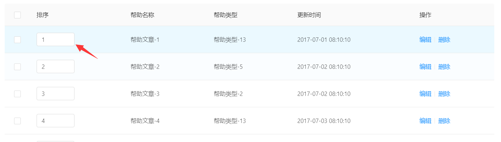

# 工具代码


# 1 函数库

放在`@util/wk`目录中


# 2 数据结构


# 3 样式


# 4 组件类


## 4.1 帮助组件

在实际项目中经常用到，经常用到 一个可以折叠的用来显示帮助的组件。[具体代码见](test-temp/src/components/Wk/PageHelp/index.tsx)

```typescript
import { PageHelp } from '@/components/Wk';
<PageHelp>帮助内容排序显示规则为排序小的在前，新增内容的在前</PageHelp>
```


见下图：


## 4.2 下拉框组件

在实际项目中经常用到，传入一个`object[]`，然后根据`name`与`id`生成一个下拉框。为了方便使用，我做了一个封装。[具体代码见](test-temp/src/components/Wk/SelectPro/index.tsx)

> 使用方法

```typescript
# 一定要加上括号
import { SelectPro } from '@/components/Wk'

# 在代码中这样引用
<SelectPro nameField="typeName" dataSource={helpTypeList} idField="typeId"/>
```


> 例子用的helpTypeList 结构说明

这个数据结构，对应了数据库中的字段名，

```typescript
export interface HelpTypeItem {
  typeId: number; // 帮助ID
  typeName:string; // 类型名称
  typeSort?:number // 排序
  helpCode?:string // 调用编号(auto的可删除)
  helpShow?:number // 是否显示,0为否,1为是,默认为1
  pageShow?:number; // 页面类型:1为店铺,2为会员,默认为1
}
```


> 参数说明

```typescript
export interface SelectProProps<T> {
  dataSource:T[]; // 下拉框的数据源
  idField:string; // id的字段名
  nameField:string; // name的字段名
  placeholder?:string; // 没有选中时的默认值
  value?:number|string; // 初始化value 为form表单使用
  onChange?:any; // onChange事件 为form表单使用
}
```


## 4.3 可编辑表格


### ① TableInputNumber

[官方组件说明](https://ant.design/components/input-number-cn/)

在表格中，某个字段可以进行编辑，当失去焦点时，就向数据库保存，如果保存失败，则返回原先数据。




> 使用方法

``` typescript
import { TableInputNumber, IHandleCellOnBlur } from '@/components/Wk'

#定义一个回调函数
  handleCellOnBlur:IHandleCellOnBlur=(itemKey,
                                      fieldName,
                                      value,
                                      callback) => {
    console.log(`itemKey:${itemKey} fieldName:${fieldName}  value:${value} `)
    if (callback) {
      callback(true);
    }
  }

#引用组件

      {
        title: '排序',
        dataIndex: 'helpSort',
        render: (text, record) => (
          <TableInputNumber
            value={text}
            itemKey={record.helpId}
            fieldName="helpSort"
            handleCellOnBlur={this.handleCellOnBlur}
            min={0}
            max={255}
            precision={0}
          />
        ),
      },

```


# 5 社区组件


## 5.1 slate

* [中文介绍](https://doodlewind.github.io/slate-doc-cn/)
* [githua](https://github.com/ianstormtaylor/slate)

国外的插件，雀语底层使用了这个组件。 在github上还比较受欢迎。


## 5.2 braft

国内出的，帮助文档还行，antd推荐的，听说使用有一定难度。 人气还不高。


### 5.2.1 安装


```shell
yarn add braft-editor
```


### 5.2.2 表单中使用

[参考文档](https://braft.margox.cn/demos/antd-form)

