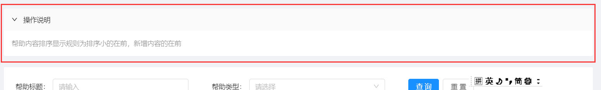

# 工具代码


# 1 函数库

放在`@util/wk`目录中


# 2 数据结构


# 3 样式


# 4 组件类


## 4.1 帮助组件

在实际项目中经常用到，经常用到 一个可以折叠的用来显示帮助的组件。[具体代码见](test-temp/src/components/Wk/PageHelp/index.tsx)

```typescript
import { PageHelp } from '@/components/Wk';
<PageHelp>帮助内容排序显示规则为排序小的在前，新增内容的在前</PageHelp>
```


见下图：




## 4.2 下拉框组件

在实际项目中经常用到，传入一个`object[]`，然后根据`name`与`id`生成一个下拉框。为了方便使用，我做了一个封装。[具体代码见](test-temp/src/components/Wk/SelectPro/index.tsx)

> 使用方法

```typescript
# 一定要加上括号
import { SelectPro } from '@/components/Wk'

# 在代码中这样引用
<SelectPro nameField="typeName" dataSource={helpTypeList} idField="typeId"/>
```


> 例子用的helpTypeList 结构说明

这个数据结构，对应了数据库中的字段名，

```typescript
export interface HelpTypeItem {
  typeId: number; // 帮助ID
  typeName:string; // 类型名称
  typeSort?:number // 排序
  helpCode?:string // 调用编号(auto的可删除)
  helpShow?:number // 是否显示,0为否,1为是,默认为1
  pageShow?:number; // 页面类型:1为店铺,2为会员,默认为1
}
```


> 参数说明

```typescript
export interface SelectProProps<T> {
  dataSource:T[]; // 下拉框的数据源
  idField:string; // id的字段名
  nameField:string; // name的字段名
  placeholder?:string; // 没有选中时的默认值
  value?:number|string; // 初始化value 为form表单使用
  onChange?:any; // onChange事件 为form表单使用
}
```


## 4.3 可编辑表格


### ① TableInputNumber

[官方组件说明](https://ant.design/components/input-number-cn/)

在表格中，某个字段可以进行编辑，当失去焦点时，就向数据库保存，如果保存失败，则返回原先数据。


> 使用方法

``` typescript
import { TableInputNumber, IHandleCellOnBlur } from '@/components/Wk'

#定义一个回调函数
  handleCellOnBlur:IHandleCellOnBlur=(itemKey,
                                      fieldName,
                                      value,
                                      callback) => {
    console.log(`itemKey:${itemKey} fieldName:${fieldName}  value:${value} `)
    if (callback) {
      callback(true);
    }
  }

#引用组件

      {
        title: '排序',
        dataIndex: 'helpSort',
        render: (text, record) => (
          <TableInputNumber
            value={text}
            itemKey={record.helpId}
            fieldName="helpSort"
            handleCellOnBlur={this.handleCellOnBlur}
            min={0}
            max={255}
            precision={0}
          />
        ),
      },

```


# 5 社区组件

常见的富文本组件

* slate
  * [re-editor](https://github.com/wowlusitong/re-editor)
* draft-js
  * braft


## 5.1 slate

* [中文介绍](https://doodlewind.github.io/slate-doc-cn/)
* [githua](https://github.com/ianstormtaylor/slate)
* [一个很棒的全屏应用](https://ory-editor.aeneas.io/)

国外的插件，雀语底层使用了这个组件。 在github上还比较受欢迎。


## 5.2 braft

国内出的，帮助文档还行，antd推荐的，听说使用有一定难度。 人气还不高。

这个控件是基于draft-js开发的。


### 5.2.1 安装


```shell
yarn add braft-editor
```


### 5.2.2 表单中使用

[参考文档](https://braft.margox.cn/demos/antd-form)

常见问题：

| 问题描述           | 说明                                                         |
| ------------------ | ------------------------------------------------------------ |
| 不显示边框         | 要添加一个样式                                               |
| 在from中不显示数据 | 要做一个state,[参考网址](https://github.com/margox/braft-editor/issues/341) |
|                    |                                                              |
|                    |                                                              |
|                    |                                                              |

#### ① 边框问题

设置css

```css
.myEditor {
  height: 60px;
  border: 1px solid #d1d1d1;
  border-radius: 5px;
}
```

引用css

```typescript
import styles from './style.less';

<FormItem>
  {getFieldDecorator('content')(
    <BraftEditor
      className={styles.myEditor}
      placeholder="请输入正文内容"
    />,
   )}
 </FormItem>
```


#### ② 在from中不显示数据

> 有两种解决方案

* 放在from中
  * 在`componentDidMount`中，使用setFieldsValue来设置初始值
  * 不放在`componentDidMount`，会出现死循环的错误。

* 不放在from
  * 通过state来保存编辑的数据。
  * 当焦点离开编辑框时，就将数据保存到state中。
  * 当点击按钮时，就从state中获取数据。

我才用了第一种方案，因为braft的开发者这么说的。

```typescript
// 做了一个回调函数
  componentDidMount() {
    const { dispatch, location } = this.props;
    const helpId:number = location.query && Number(location.query.helpId)
    dispatch({
      type: 'HelpEdit/queryHelpById',
      payload: { helpId },
      callback: this.queryHelpCallback,
    });
  }

// 回调函数中设置数值
  queryHelpCallback =() => {
    const {
      form: { setFieldsValue }, HelpEdit: { currentItem } } = this.props;
    if (currentItem && currentItem.helpInfo) {
      const content = BraftEditor.createEditorState(currentItem.helpInfo);
      setFieldsValue({
        content,
      })
    }
  }
  
// 在from中引用这个数值
<FormItem>
  {getFieldDecorator('content')(
    <BraftEditor
      className={styles.myEditor}
      placeholder="请输入正文内容"
    />,
   )}
 </FormItem>


// 点击按钮事件
  handleSubmit = (e: React.FormEvent) => {
    // 得到currentItem,也就是最原始的数据,这里有只取到主键与更新的字段。
    const { dispatch, form, HelpEdit: { currentItem } } = this.props;
    e.preventDefault();
    form.validateFieldsAndScroll((err, values) => {
      const helpInfo = values.content.toRAW();
      const payload = {
        ...currentItem,
        ...values,
        helpInfo,
      }
      if (!err) {
        dispatch({
          type: 'HelpEdit/updateHelp',
          payload,
        });
      }
    });
  };

```


#### ③  定制工具栏


#### ④ 单一图片上传

官方默认的是将文件转变格式后，将文件的内容一起保存。这样会大量占用数据库资源。所以建议使用两外的方法。

集成antDesign的文件上传。


#### ⑤ 定义媒体中心

参考微信的设置


# 6 mock


## 6.1 模拟测试数据

http://mockjs.com/  这个网址有相关的用法。

可以模拟数字、文字、日期、图片、网址、地址等等


## 6.2 模拟文件上传

[文件上传的两种情况及mock时对应处理办法](https://blog.csdn.net/zccst/article/details/84631488)


