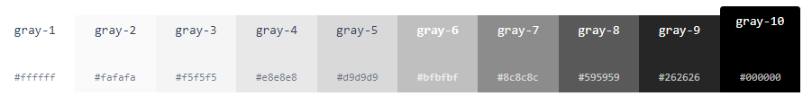

# 设计规范

详细内容请参考[antDesign官方文档说明](https://ant.design/docs/spec/introduce-cn)。下面的内容是节选比较重要的内容。

# 1.  颜色


## 1.1 基础颜色

基本上不用自己来定义颜色了。下面颜色做为参考

Ant Design 的基础色板共计 120 个颜色，包含 12 个主色以及衍生色。这些颜色基本可以满足中后台设计中对于颜色的需求。

如果下面颜色不够用，可以[通过工具进行定义](https://ant.design/docs/spec/colors-cn#%E8%89%B2%E6%9D%BF%E7%94%9F%E6%88%90%E5%B7%A5%E5%85%B7)


## 1.2 中性色板

中性色包含了黑、白、灰。Ant Design 的中性色板一共包含了从白到黑的 10 个颜色。




- [ ] 完善：应该定义好每个应用的场景


## 1.3 产品颜色定义


### ① 品牌色(需自定义)

建议选择色板从浅至深的第六个颜色作为主色。

应用场景包括：关键行动点，操作状态、重要信息高亮，图形化等场景。 下面是例子：


### ② 功能色-警告提示

功能色代表了明确的信息以及状态，比如成功、出错、失败、提醒、链接等。


### ③ 中性色-文字边框背景

中性色主要被大量的应用在界面的文字部分，此外背景、边框、分割线、等场景中也非常常见。


## 1.4 在代码中使用

我们为程序员提供了色板的 Less 和 JavaScript 的使用方式。

- **Less**

  ```less
  @import '~antd/es/style/themes/default.less', .selector {
    color: @blue-5;
    background-color: @gold-2;
  }
  ```

  所有色板变量列表：[color.less](https://github.com/ant-design/ant-design/blob/5ab2783ff00d4b1da04bb213c6b12de43e7649eb/components/style/color/colors.less)。

  

- **JavaScript**

  ```null
  npm install @ant-design/colors
  ```

  ```js
  import { blue } from '@ant-design/colors';
  console.log(blue); // ['#E6F7FF', '#BAE7FF', '#91D5FF', ''#69C0FF', '#40A9FF', '#1890FF', '#096DD9', '#0050B3', '#003A8C', '#002766']
  console.log(blue.primary); // '#1890FF'
  ```

  更多使用方式：[@ant-design/colors](https://www.npmjs.com/package/@ant-design/colors)


# 2. 布局


## 2.1 画板尺寸

统一的画板尺寸=1440。

## 2.2 适配方案

中台系统的用户的主流分辨率主要为 1920、1440 和 1366，个别系统还存在 1280 的显示设备。

### ① 左右布局

左边**固定**，右边**动态缩放**。


### ② 上下布局

对两边留白区域进行**最小值**的定义，当留白区域到达**最小值**限定值之后再对中间的主内容区域进行动态缩放。


## 2.3 网格单位

网格的基数为 **8**


## 2.4 栅格定义

对内容区域进行 24 栅格的划分设置，如下图所示。

* gutter：间隔，宽度是固定值

* column：内容宽度，会自动放缩。
* 1列宽度=1column+1gutter


## 2.5 常用尺寸


常用的从尺寸大小，保持了 8 倍数的原则


### ① 框架尺寸


### ② 间隔尺寸

- [ ] 需要补充：定义各个尺寸间隔的尺寸


# 3. 字体


## 3.1 字体选择

### ① 选择系统字体

优先使用系统默认的界面字体，同时有备用字体库。

```css
font-family: -apple-system, BlinkMacSystemFont, 'Segoe UI', 'PingFang SC', 'Hiragino Sans GB',
  'Microsoft YaHei', 'Helvetica Neue', Helvetica, Arial, sans-serif, 'Apple Color Emoji',
  'Segoe UI Emoji', 'Segoe UI Symbol';
```

> 参考自 https://www.smashingmagazine.com/2015/11/using-system-ui-fonts-practical-guide/ 和 http://markdotto.com/2018/02/07/github-system-fonts/


### ② 数字纵向字体

数字经常需要进行纵向对比展示，我们单独将数字的字体 [font-variant-numeric](https://www.fonts.com/content/learning/fontology/level-3/numbers/proportional-vs-tabular-figures) 设置为 `tabular-nums`，使其为等宽字体。

参考 https://stackoverflow.com/questions/32660748/how-to-use-apples-new-san-francisco-font-on-a-webpage#comment78509178_32660790


## 3.2 主字体大小

选择**14px**便于阅读。


## 3.3 字体大小与行高

建议的主要字体为 14，与之对应的行高为 22。


对应表：字体大小+8px


## 3.4 字重

中文自重： regular 以及 medium 的两种字体重量，分别对应代码中的 400 和 500。

英文自重：在英文字体加粗采用 semibold 的字体重量，对应代码中的 600。


## 3.5 字体颜色

 WCAG 的标准：将正文文本、标题和背景色之间保持在了 7:1 以上的 AAA 级对比度。


# 4. 图标

图片设计起来还是比较复杂的，可以参考[图标设计原则](https://ant.design/docs/spec/icon-cn)


## 4.1 常用图标库

遇到没有的图标，可以去基础库找找看看。

* [antDesign图标库](https://ant.design/components/icon-cn/)
* [阿里图标库](https://www.iconfont.cn/)


使用技巧：

* [Axure中使用Iconfont-阿里巴巴矢量图标库](https://jingyan.baidu.com/article/380abd0a080a511d91192c58.html)


## 4.2 常用图标


①②③④⑤⑥⑦⑧⑨


# 常用网址

- pro
  - [文档](https://pro.ant.design/docs/getting-started-cn)
  - [演示](https://preview.pro.ant.design/)
- Ant Design
  - [文档](https://ant.design/docs/react/introduce-cn)