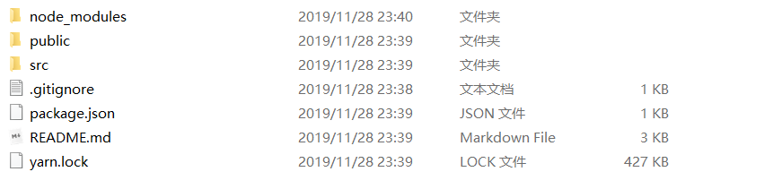
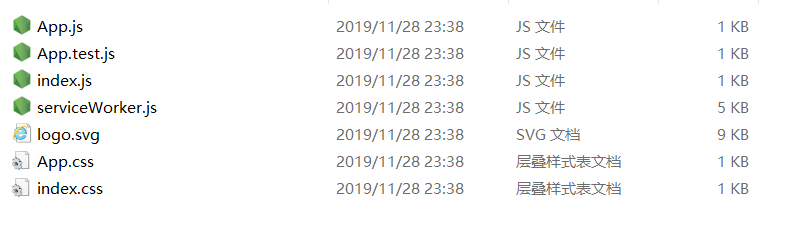
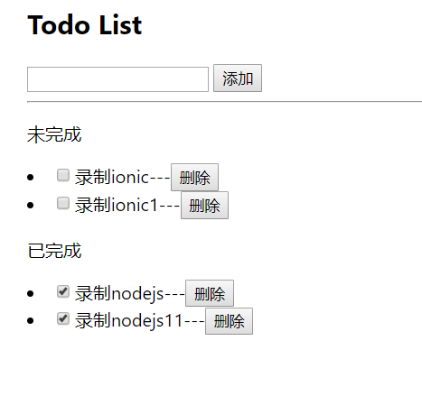
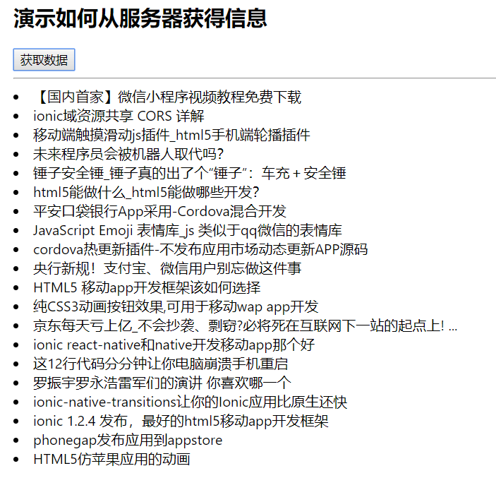
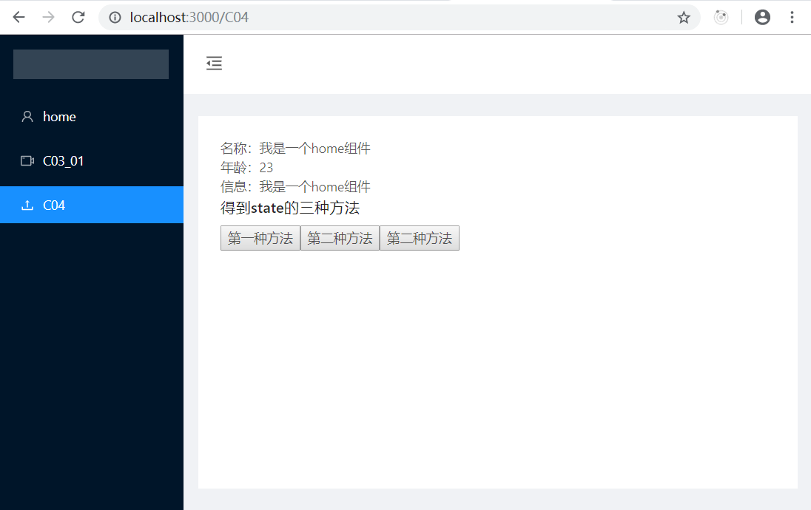

# React

React目录结构  React创建组件、 ReactJSX语法、 React绑定数据 React绑定对象 、React绑定属性( 绑定class  绑定style 图片)


上一级生成了react的代码，怎么读这些代码，需要先了解下面的内容。

本节要解决这几个问题：

1、React目录结构都是什么？

2、如何创建一个React组件

3、ReactJSX语法是什么东西？

4、如何绑定数据？

5、如何绑定对象？

6、如何绑定属性：绑定class，绑定style与图片。


## ① 代码自动生成

VsCode插件

[React-Native/React/Redux snippets for es6/es7](https://marketplace.visualstudio.com/items?itemName=EQuimper.react-native-react-redux)

| 快捷方式 | 说明          |
| -------- | ------------- |
| imrc     | 导入react组件 |
| cccs     | 生成一个模板  |
| cl       | 生成日志      |
|          |               |
|          |               |
|          |               |
|          |               |


## ② 清空chrome网站的缓存

chrome会保存一些本地的缓存，这样就不能及时获得服务器上最新的版本，所以要及时情况浏览器缓存。

https://jingyan.baidu.com/article/6079ad0e34862768ff86dbd6.html


## ③  程序打包与部署

```
yarn build
```

然后放到要给nginx的根目录中就可以了。


# 1 React目录结构

参考[React 环境搭建](react-env.md)


## ① 根目录




| 名称         | 说明                  | 备注     |
| ------------ | --------------------- | -------- |
| node_modules | 使用到的组件          | 不用管   |
| public       | 一些静态文件          | 参考一下 |
| src          | 主要的程序            | 常用目录 |
| .gitignore   | 上传忽略的git配置文件 | 不常用   |
| package.json | 自动生成的包文件      | 不用管   |
| README.md    | 帮助文档              | 不用管   |
| yarn.lock    | yarn自动生成的文件    | 不用管   |
|              |                       |          |


## ② public目录

这里面只有一个index.html要关注，其他都是辅助文件，可以有可无。

jindex.html中有一个`<div id="root"></div>` 今后会用到。


## ③ src目录




| 名称             | 说明                   | 备注   |
| ---------------- | ---------------------- | ------ |
| index.js         | 入口文件               |        |
| serviceWorker.js | react加速文件          | 不用管 |
| App.js           | 一个组件               |        |
| App.test.js      | 测试组件的代码         |        |
| logo.svg         | 一个图片文件，没有啥用 |        |
| App.css          | App样式文件            |        |
| index.css        | index的样式            |        |
|                  |                        |        |

在实际项目中不会这样配置，这样把所有文件都放在一起，比较乱。


> index.js

将<App/> 组件 刷新到 document.getElementById('root')

```js
import React from 'react';
import ReactDOM from 'react-dom';
import './index.css';
import App from './App';
import * as serviceWorker from './serviceWorker';

ReactDOM.render(<App />, document.getElementById('root'));

// If you want your app to work offline and load faster, you can change
// unregister() to register() below. Note this comes with some pitfalls.
// Learn more about service workers: https://bit.ly/CRA-PWA
serviceWorker.unregister();
```


> App.js

主主组件，为了更好理解，我修改了一下<div>中的内容。

这里使用`ReactJSX语法` ，可以在一个js函数中返回一个html模板与样式。

```jsx
import React from 'react';
import logo from './logo.svg';
import './App.css';

function App() {
  return (
    <div className="App">
        Hello APP
    </div>
  );
}

export default App;
```


## ④ 思考问题


> 问题

* 在index.html是否可以挂多个组件呀？
* 实际项目中，工程目录是怎么做的？


> 回答

* 可以，这样可以将react 嵌入的任何的html页面

* 可以看看antDesignPro的目录规划，尽量将每个组件单独一个目录。

  * 每个组件的js与自己的css文件会放在一起。

  

> 行动

* 你能调整一下目录吗？


# 2 创建无状态组件

为了便于管理，在scr目录下建立一个目录：components 。

今后所有新建组件都放到这个目录中。是学习用，今后就不未每个例子单独建立子目录了。


## 2.1 第一个组件

这个组件没有什么功能，就是为了显示一句话。


### ① 新建一个组件

创建一个C02_01.js文件，组件用大写开头。

```jsx
import React from 'react';

function C02_01() {
  return (
    <div>
        <h1>Home</h1>
        <p>this my first components</p>  
    </div>
  );
}

export default C02_01;
```


### ② 引用这个组件

修改Index.js，这里添加了两行代码。首先import 组件，然后使用这个组件。

```jsx
import React from 'react';
import ReactDOM from 'react-dom';
import './index.css';
import Test from './components/C02_01';

import * as serviceWorker from './serviceWorker';

ReactDOM.render(<Test />, document.getElementById('root'));


// If you want your app to work offline and load faster, you can change
// unregister() to register() below. Note this comes with some pitfalls.
// Learn more about service workers: https://bit.ly/CRA-PWA
serviceWorker.unregister();
```


### ③ 思考问题

我能把这个Home组件挂到index.js中吗？应该怎么做？

答案：是可以的。


## 2.2 可接收参数

可以从组件中接收数据，并展示出来。


### ① 新建一个组件

这个函数可以带一个参数，并且获得参数中的数值。

```jsx
import React from 'react';
function C02_02(props) {
  const {name,title} = props;
  return (
    <div>
        <h2>带参数的组件</h2>
        name:{name} --title:{title}  
    </div>
  );
}
export default C02_02;
```


### ② 父组件传递数值

修改App.js ，这里简化一下代码。只给出return部分代码。

将数值通过属性传递给组件。

```jsx
import React from 'react';
import ReactDOM from 'react-dom';
import './index.css';
import Test from './components/C02_02';

import * as serviceWorker from './serviceWorker';
ReactDOM.render(<Test name='小王' title='总经理'  />, document.getElementById('root'));
// If you want your app to work offline and load faster, you can change
// unregister() to register() below. Note this comes with some pitfalls.
// Learn more about service workers: https://bit.ly/CRA-PWA
serviceWorker.unregister();
```


### ③ 思考问题

> 问题

* 问题1：不传参数会有什么问题吗？
* 问题2：怎么设置默认值？
* 问题3：如何对props进行验证？


> 答案

* 问题1：不会报错，显示空。
* 问题2：可以这么来做。

```jsx
import React from 'react';

function ListStu(props) {
  const {name,title} = props;
  return (
    <div>
        name:{name} --title:{title}  
    </div>
  );
}

// 默认 Props
ListStu.defaultProps = {
  name: 'Runoob' ,
  title: 'Manager'
};

export default ListStu;
```


* 问题3

Props 验证使用 **propTypes**，它可以保证我们的应用组件被正确使用，React.PropTypes 提供很多验证器 (validator) 来验证传入数据是否有效。当向 props 传入无效数据时，JavaScript 控制台会抛出警告，具体见[更多说明](http://www.runoob.com/react/react-props.html)。

 


## 2.3 CSS、IMG与内部函数

如何在组件中使用css、img与内部函数 ？


### ① 准备css与img

* 在scr目录下建立一个imgs目录，在下面放一个1.png的文件。
* 在components目录下，建立一个test.css文件。

> test.css文件

```css
.color1{
    color:red;
  }

  .color2{
    color:blue;
  }
```


### ② 在Home.js中引用

* 通过import 引用css与img
* 可以通过内部listResult，来循环生成相关函数。


```jsx
import React from 'react';
import css  from './test.css';
import img1 from '../imgs/1.png';

function C02_03() {
  var list=['一年级','二年级','三年级'];
  let listResult=list.map(function(value,key){
      return <li key={key}>{value}</li>
  })

  return (
    <div>
        <h1>如何引用CSS、IMG与内部函数</h1>
        <div className='color1' >this my first components</div>  
        
        {listResult}
    </div>
  );
}

export default C02_03;
```

如果是远程图片，可以直接写地址。


## 2.4 本节总结

>  JSX编码注意事项

* `return`所有的模板要被一个根节点包含起来
* 通过{}绑定数据  
* 绑定属性注意

  * class 要变成 className

  * for 要变成  htmlFor

  * style属性和以前的写法有些不一样

    * `<div style={{'color':'blue'}}>`
    * `<div style={{'color':this.state.color}}>`
* 循环输出控件要加key
* 组件名称首字母大写、组件类名称首字母大写


# 3 组件的其他写法


## 3.1 传统的class用法

上一章节的组件，是用的React新的写法，但是有些老的组件是用传统的`class`来写的。

为了让大家能读懂那些老的组件代码，这里给出老的写法。

- 使用了class
- 内部有constructor方法与render方法
- 可以在constructor中使用状态变量：state.

```jsx
import React from 'react';

import css  from './test.css';
import img1 from '../imgs/1.png';

class C03_01 extends React.Component{
    constructor(props){
        super(props);   //固定写法
        this.state={
            msg:'我是一个home组件',
        }
    }

    render(){
        var list=['11111111111','222222222222','3333333333333'];
        let listResult=list.map(function(value,key){
            return <li key={key}>{value}</li>
        })
        return(
            <div>
            <h1>Old</h1>
            <div className='color1' >this my first components</div>  
            
            {listResult}
        </div>
        );
    }
}

export default C03_01;
```


## 3.2 使用TypeScript与Less

有些系统中，会使用TypeScript与Less。这个今后做为专题来写。 不然看不同antDesignPro的代码。


# 4 状态值的获取与变更

与props不同，react中还有一个概念叫做state，那么什么是state呢？


## 4.1 建立一个state组件

建立一个`C04.js`的组件，并修改一下index.js这样可以在浏览器中查看。

> C04.js

```js
import React from 'react';

class C04 extends React.Component {
    constructor(props) {
        super(props);   //固定写法
        this.state = {
            msg: '我是一个home组件',
        }
    }

    render() {
        return (
            <div>
              {this.state.msg}      
            </div>
        );
    }
}

export default C04;
```


> index.js的代码

```js
import React from 'react';
import ReactDOM from 'react-dom';
import './index.css';
import C04 from './components/C04';

import * as serviceWorker from './serviceWorker';

ReactDOM.render(<C04 />, document.getElementById('root'));


// If you want your app to work offline and load faster, you can change
// unregister() to register() below. Note this comes with some pitfalls.
// Learn more about service workers: https://bit.ly/CRA-PWA
serviceWorker.unregister();
```


## 4.2 事件中得到状态

在事件函数中为了得到this.state，需要将this给绑定到事件函数中，一共有这三种方法。

| 名称         | 说明       |
| ------------ | ---------- |
| 箭头函数     | 常用，推荐 |
| 绑定this     | 常用       |
| 构造函数注册 | 不常用     |

```js
import React from 'react';


class C04 extends React.Component {
    constructor(props) {
        super(props);   //固定写法
        this.state = {
            msg: '我是一个home组件',
            name:'小王',
            age: '23'
        }

        //构造函数注册
        this.fun2= this.fun2.bind(this);
    }

    //箭头函数
    fun1=()=>{
        alert(this.state.name)
    }

    fun2(){
        alert(this.state.msg)
    }

    fun3(){
        alert(this.state.age)
    }

    render() {
        return (
            <div>
              名称：{this.state.msg} <br/>
              年龄：{this.state.age} <br/>
              信息：{this.state.msg} <br/>
              <div>
                得到state的三种方法  
                <button onClick={this.fun1}> 第一种方法 </button>
                <button onClick={this.fun2}> 第二种方法 </button>
                {/* 绑定this */}
                <button onClick={this.fun3.bind(this)}> 第二种方法 </button>
              </div>  

            </div>
        );
    }
}

export default C04;
```


## 4.3 改变状态

改变状态有三种方法，同得到状态值。 但是如果要往函数里面传递参数，还需要用到bing这一种方法。

下面新建立一个`C04_set.js`文件。

```js
import React from 'react';

class C04_set extends React.Component {
    constructor(props) {
        super(props);   //固定写法
        this.state = {
            msg: '我是一个home组件',
            name:'小王',
            age: '23'
        }

        //构造函数注册
        this.fun2= this.fun2.bind(this);
    }

    //箭头函数
    fun1=()=>{
        this.setState({
            msg:'new massage'
        })
    }

    fun2(){
        this.setState({
            name:'new name'
        })
    }

    fun3(){
        this.setState({
            age:'new age'
        })
    }

    fun4(arg1){
        this.setState({
            age:arg1
        })
    }

    render() {
        return (
            <div>
              名称：{this.state.msg} <br/>
              年龄：{this.state.age} <br/>
              信息：{this.state.name} <br/>
              <div>
                <button onClick={this.fun1}> 第一种方法 </button>
                <button onClick={this.fun2}> 第二种方法 </button>
                {/* 绑定this */}
                <button onClick={this.fun3.bind(this)}> 第三种方法 </button>
                <button onClick={this.fun4.bind(this,"8888888")}> 传递参数方法 </button>
              </div>  

            </div>
        );
    }
}


export default C04_set;
```


# 5 组件值的获取与变更

有两种方法：

* 通过事件中的event参数。
* 通过re


推荐第一中，使用event来获得参数。

## 5.1 通过事件中的event参数

在函数中，可以得到event对象。

下面代码的要点：

* 通过event.target来改变或设置
  * `event.target.style.background='red';`
  * `event.target.getAttribute('aid')`
* 通过`target.getAttribute`可以得到 html标签中的属性
* `onChange` 函数可以得到`event`对象


```js
import React, { Component } from 'react';

class C05_01 extends Component {
    constructor(props) {
        super(props);
        this.state = {  };
    }

    fun1=(event)=>{
        //设置dom的属性
        event.target.style.background='red';
        //获取dom的属性
        alert(event.target.getAttribute('aid'))
    }

    inputChange=(e)=>{
        console.log(e.target.value);
        this.setState({
            username:e.target.value
        })
    }

    getInput=()=>{
        alert(this.state.username);
    }


    render() {
        return (
            <div>
              <h1>获取组件值-方法1</h1>
              <button aid='ddddd'  onClick={this.fun1}>通过Dom方法</button>
              <br/>
              <input onChange={this.inputChange}/> <button onClick={this.getInput}>获取input的值</button> 
            </div>
        );
    }
}

export default C05_01;
```


## 5.2 通过refs

新建一个C05_02组件，使用了refs来替换了event.

* 给每个组件添加ref属性，并指定唯一名字，例如：`ref='but1'`
* 在函数中通过`this.refs.but1`来得到这个组件

```jsx
import React, { Component } from 'react';

class C05_02 extends Component {
    constructor(props) {
        super(props);
        this.state = {  };
    }

    fun1=()=>{
        //设置dom的属性
        let but1=this.refs.but1
        but1.style.background='red';
        //获取dom的属性
        alert(but1.getAttribute('aid'))
    }

    inputChange=()=>{
        
        this.setState({
            username:this.refs.input1.value
        })
    }

    getInput=()=>{
        alert(this.state.username);
    }


    render() {
        return (
            <div>
              <h1>获取组件值-方法2</h1>
              <button  ref='but1' aid='ddddd'  onClick={this.fun1}>通过ref方法</button>
              <br/>
              <input  ref='input1'  onChange={this.inputChange}/> <button onClick={this.getInput}>获取input的值</button> 
            </div>
        );
    }
}

export default C05_02;
```


# 6 组件的其他应用


## 6.1 键盘事件

常见的包含`inputKeyUp`与`inputonKeyDown` ，通过event获得数值。

```jsx
import React, { Component } from 'react';
class C06_01 extends Component {
    constructor(props) {
        super(props);
        this.state = {  };
    }


    //键盘事件
    inputKeyUp=(e)=>{
        if(e.keyCode==13){
            alert(e.target.value);
        }
    }
    inputonKeyDown=(e)=>{
        if(e.keyCode==13){
            alert(e.target.value);
        }
    }

    render() {
        return (
            <div>
                <h2>键盘事件-回车得到数值</h2>
                <input onKeyUp={this.inputKeyUp}/>
                <br /><br />
                <input onKeyDown={this.inputonKeyDown}/>
            </div>
        );
    }
}

export default C06_01;
```


## 6.2 双向绑定

model改变影响View    view改变反过来影响model


```js
import React, { Component } from 'react';
class C06_02 extends Component {
    constructor(props) {
        super(props);
        this.state = {};
    }

    inputChange = (e) => {
        this.setState({
            username: e.target.value
        })

    }
    setUsername = () => {
        this.setState({
            username: '李四'
        })

    }

    render() {
        return (
            <div>
                <h2>双向绑定</h2>
                {/* model改变影响View    view改变反过来影响model  */}
                <input value={this.state.username} onChange={this.inputChange} />
                <p> {this.state.username}</p>
                <button onClick={this.setUsername}>改变username的值</button>
            </div>
        );
    }
}

export default C06_02;
```


# 7 表单介绍

给基础组件，例如输入框，选择框等赋值时，可以通过`defaultValue`或`value`，这两个的却别是，`value`赋值后，可以进行`双向绑定`， 而`defaultValue`不行。

## 7.1 一个简单表单

下面描述常用组件的使用方法：`text`,`radio`,`select`,`checkbox`,`textarea`


具体步骤如下：

1、设置数据模型

2、撰写Form

3、添加具体的组件


## 7.2 TodoList

主要功能如下：

* 通过输入框，可以往一个todolist中追加一条记录。
* 可以删除某条记录
* 可以确定一条记录是完成，还是未完成状态。




[相关代码C07_02.js](my-app/src/components/C07_02.js)


下面代码的注意事项

### ① map循环生成代码中

下面li的函数`del` 对应的一定要用箭头函数，不然会报错。因为return时，当前没有绑定this

```jsx
{
    this.state.todoList.map((value,key)=>{
        return(
            <li key={key} >{value}      ---<button  onClick={this.del.bind(this,key)}>删除</button></li>
        )
    })
}
```


### ② 删除数组某个元素

使用splice来进行删除。

```jsx
splice(key,1);
```


## 7.3 用缓存保存TodoList

使用localStorage来缓存数据，为了便于调用，这里可以将localStorage封装成一个模块。

> 主要功能有

* 使用到了`localStorage`缓存功能
* 使用到`JSON`解析功能
* 使用到了`componentDidMount`加载数据的功能


> 具体代码有：

* [storage.js  缓存模板](my-app/src/model/storage.js)
* [C07_03.js  在上一节基础上做的缓存功能](my-app/src/components/C07_03.js)


# 8 父子组件

通过了解父子组件的关系，就能更好的修改例如`antDesign`组件的相关内容了。

具体代码见：

- [C08_home.js  父组件代码](my-app/src/components/C08_home.js)
- [C08_header.js 子组件代码](my-app/src/components/C08_header.js)


## 8.1 父组件传值给子组件

父组件不仅可以给子组件`传值`，还可以给子组件`传方法`,以及把`整个父组件`传给子组件。

> 传值过程：

1.在调用子组件的时候定义一个属性  `<Header msg='首页'></Header>`

2.子组件里面 `this.props.msg`


## 8.2 子组件调用父组件

子组件通过父组件传入的`函数` 或`this`实例，来调用任何父组件里面的`state`或`方法`。


## 8.3 父组件主动调用子组件

父组件通过`ref`可以获得整个子组件实例，然后去修改子组件state与方法

> 调用过程

1、调用子组件的时候指定`ref`的值   `<Header ref='header'></Header>`      

2、通过`this.refs.header`  获取整个子组件实例


## 8.4 输入值的默认值与校验

子组件可以对父组件的输入值，进行默认值与校验。

> defaultProps:

```
父子组件传值中，如果父组件调用子组件的时候不给子组件传值，可以在子组件中使用defaultProps定义的默认值
```


> propTypes：验证父组件传值的类型合法性

```
1、引入import PropTypes from 'prop-types';

2、类.propTypes = {
   name: PropTypes.string
};
```


> 更多校验方法有

 [官方文档介绍](https://reactjs.org/docs/typechecking-with-proptypes.html)

* 校验类型

  * 基本类型
  * 多个类型
  * react 组件或class

* 校验值

* 校验是否必填

* 自己定义校验函数

  


# 9 与服务器交互

得到服务器中的json数据，常用的有`axios`与`fetch-jsonp`第三方工具。这里推荐使用`fetch-jsonop`，因为`fetch-jsonop`在前端就可以解决跨域问题，而`axios` 需要在后端解决跨域问题。


> 具体界面




[C09_01.js参考代码](my-app/src/components/C09_01.js)


>  跨域问题的解决方案

- jsonp 来跨域
- 后台设置成可以跨域


> 使用第三方组件的步骤。

* 找到这个组件的npm或github主页，学习一下。

* 使用npm来安装组件。

* 在程序中使用这个组件

  * 需要Import这个组件。

  

## ①  参考网址

* [fetch-jsonp的npm网址](https://www.npmjs.com/package/fetch-jsonp)
* [github网址](https://github.com/camsong/fetch-jsonp)


## ②  安装fetch

```
cnpm install fetch-jsonp
```

也可是使用

```
yarn add fetch-jsonp
```


## ③ 使用fetch

```jsx	
import fetchJsonp from 'fetch-jsonp';

//添加函数
getDate=()=>{
    var api="http://www.phonegap100.com/appapi.php?a=getPortalList&catid=20";
    fetchJsonp(api)
        .then(function(response) {
        return response.json()
    }).then((json)=> {
        console.log(json);
        this.setState({
            list:json.result
        })
    }).catch(function(ex) {
        console.log('parsing failed', ex)
    })       
}
```


# 10 组件生命周期

[官方参考文档](https://reactjs.org/docs/react-component.html)


通过对生命周期的理解，知道应该在什么时候，从服务器获得数据，并刷新组件。

## ① 加载时

组件加载的时候触发的函数

```
constructor 、componentWillMount、 render 、componentDidMount
```


## ② 更新时

组件数据更新的时候触发的生命周期函数：

```
shouldComponentUpdate、componentWillUpdate、render、componentDidUpdate
```


## ③ 父组件改变props传值时

父组件里面改变props传值的时候触发的：

```
componentWillReceiveProps
```


## ④ 组件销毁时

组件销毁的时候触发的：

```
componentWillUnmount
```


## ⑤ 常用生命周期函数

常用的生命周期函数

```
*加载的时候：componentWillMount、 render 、componentDidMount（dom操作）

更新的时候：componentWillUpdate、render、componentDidUpdate

*销毁的时候： componentWillUnmount
```


## ⑥ 注意事项

生命周期的执行顺序是`render`->`componentDidMount`。

一般会在`componentDidMount`中进行数据查询。但是`render`会找不到这些数据，所以在`render`中要做非空判断。


# 11 页面路由

通过路由可以在不同页面之间进行跳转。[官方文档](https://reacttraining.com/react-router/web/example/basic)  


## 11.1 基本路由

基本步骤如下：

### ① 安装

```shell
cnpm install react-router-dom --save
#或
yarn add react-router-dom
```


### ② 引入react-router-dom

找到项目的根组件引入react-router-dom ，例如App.js

```js
import { BrowserRouter as Router, Route, Link } from "react-router-dom";
```


### ③ 配置路由

在App.js的return中加入下面的代码。exact表示严格匹配“/”

```jsx
    <Router>
          <li><Link to="/">第一个页面</Link></li>
          <li><Link to="/C02_02">带参数的组件</Link></li>
          <li><Link to="/C02_03">如何引用CSS、IMG与内部函数</Link></li>
          <Route exact path="/">
            <C02_01/>
          </Route>
          <Route path="/C02_02">
            <C02_02 name="小王" title="产品经理" />
          </Route>
          <Route path="/C02_03">
            <C02_03/>
          </Route>
     </Router>
```


## 11.2 路由传值

两种方法，一种是通过`url`进行传值，一种是通过链接的`?`来传入参数


### 11.2.1 URL传值

[官方的例子，通过函数来实现，没有使用class](https://reacttraining.com/react-router/web/example/url-params)

#### ① 在App.js中添加路由

```js
<Route path="/C11_02_01/:aid" component={C11_02_01}/>
```


下面这个是错误的，得不到数值

```js
<Route path="/C11_02_01/:aid" >
    <C11_02_01/>
</Route>
```


#### ② 在C11_02.js中调用

```js
<Link to={`/C11_02/${value.aid}`}>{value.title}</Link>
```


#### ③ 详情页得到传入值

```js
this.props.match.params.aid
```


### 11.2.2 ?传值

[官方文档](https://reacttraining.com/react-router/web/example/query-parameters)

#### ① 在App.js中添加路由

```js
<Route path="/C11_02_02" component={C11_02_02}/>
```


下面这个是错误的，得不到数值

```js
<Route path="/C11_02_02" >
    <C11_02_02/>
</Route>
```


#### ② 在C11_02.js中调用

```js
<Link to={`/C11_02_02?aid=${value.aid}&bid=123`}>{value.title}</Link>
```


#### ③ 详情页得到传入值

要解析?后面的内容，需要安装一个`url`组件。

```shell
yarn add url
```


在代码中得到数值：

```js
var query=url.parse(this.props.location.search,true).query;
let aid=query.aid
```


## 11.3 利用Redirect进行跳转


[C11_03.js参考代码](my-app/src/components/C11_03.js)

### ① 引入Redirect

```js
import {Redirect} from "react-router-dom";
```


### ② 定义一个flag

```js
this.state = { 
		loginFlag:false            
};
```


### ③ render里判断是否跳转

render里面判断flag 来决定是否跳转

```js
if(this.state.loginFlag){
	return <Redirect to={{ pathname: "/" }} />;
}
```


### ④ 改变loginFlag状态进行跳转

通过js改变loginFlag的状态，改变以后从新render 就可以通过Redirect自己来跳转。

在登录跳转和权限认证用的比较多。


## 11.4 路由嵌套

这部分不用写代码，实际上就是把不同的路由放到不同的组件中。

以下有两个注意事项：

* 在使用子地址的时候，可以通过：`${this.props.match.url}/add` 这个变量来得到父亲地址。
* 可以将不同的路由写入不同的文件中。


# 12 路由模块化

上一节路由讲到路由在文件中是怎么来写的。

```js
<Router>
   <Route exact path="/">
     <C02_01/>
   </Route>
   <Route path="/C02_02">
      <C02_02 name="小王" title="产品经理" />
   </Route>
   <Route path="/C02_03">
       <C02_03/>
   </Route>
</Router>
```

有没有可能将这个路由写到一个配置文件中，然后通过js循环写出来呢？

这部分[可以参考官方文档](https://reacttraining.com/react-router/web/example/route-config)


## 12.1 模块化


### ① 将App.js复制到App2.js


### ② 增加一个routes变量

```js
const routes = [
  {
    path: "/",
    exact:true,  
    component: C02_01
  },
  {
    path: "/C02_01",
    component: C02_01
  },
  {
    path: "/C02_02",
    component: C02_02
  },
]    
```

`exact:true`精确匹配路由，这个变量名称可以修改，例如antDesign中就使用了其他内容表示了不同的意思


### ③ 通过循环展示路由

> 添加一个函数

```js
function RouteWithSubRoutes(route) {
  return (
    <Route
      path={route.path}
      render={props => (
        // pass the sub-routes down to keep nesting
        <route.component {...props} routes={route.routes} />
      )}
    />
  );
}
```


> 在原先的地方，用js循环展示出来

```js
<Switch>
    {routes.map((route, i) => (
              <RouteWithSubRoutes key={i} {...route} />
    ))}
</Switch>
```

Switch：作用是显示多个。


## 12.2 传值


# 13 React中使用Antd


## 13.1 简单使用


### ① 安装antd组件

```shell
yarn add antd
```


### ②  引入css

在index.css中追加上antDesign的css

```css
@import '~antd/dist/antd.css';
```


### ③ 在具体页面中使用

引入相应的组件，并且按照规范来使用

```js
import React, { Component } from 'react';
import { Button,Icon } from 'antd';

class C13_01 extends Component {
    constructor(props) {
        super(props);
        this.state = {  };
    }
    render() {
        return (
            <div>
                <h1>antDesign 测试</h1>
                <Button type="primary">antd的按钮</Button>
                <Icon type="pic-right" theme="outlined" />
            </div>
        );
    }
}

export default C13_01;
```


## 13.2 按需引入css样式

我们现在已经把组件成功运行起来了，但是在实际开发过程中还有很多问题，例如上面的例子实际上加载了全部的 antd 组件的样式（对前端性能是个隐患）。


### ① 安装（react-app-rewired）

一个对 create-react-app 进行自定义配置的社区解决方案 

```
yarn add react-app-rewired
```


### ② 修改 package.json

react-scripts 需改为react-app-rewired

```json
  	"scripts": {
    		"start": "react-app-rewired start",
    		"build": "react-app-rewired build",
    		"test": "react-app-rewired test --env=jsdom",
    		"eject": "react-app-rewired eject"
 	 }
```


### ③ 创建一个 config-overrides.js 

在项目根目录创建一个 config-overrides.js 用于修改默认配置

```js
	module.exports = function override(config, env) {
 		 // do stuff with the webpack config...
 	 	return config;
	};
```


### ④ 安装babel 插件

```
yarn add babel-plugin-import 
```


### ⑤ 修改 config-overrides.js

```js
const { injectBabelPlugin } = require('react-app-rewired');

module.exports = function override(config, env) {
    config = injectBabelPlugin(
     		   ['import', { libraryName: 'antd', libraryDirectory: 'es', style: 'css' }],
        	   config,
  	  );
   	 return config;
};
```


### ⑥ 移除前面全量添加的antd.css

然后移除前面在 src/index.css 里全量添加的 @import '~antd/dist/antd.css'; 直接引入组件使用就会有对应的css


## 13.3 使用antDesign的layout




### ① 新建一个app3.js

从官网选一个样式代码复制过来：https://ant.design/components/layout-cn/


### ② 将样式复制到index.css

```css

 .trigger {
  font-size: 18px;
  line-height: 64px;
  padding: 0 24px;
  cursor: pointer;
  transition: color 0.3s;
}

.trigger:hover {
  color: #1890ff;
}

.logo {
  height: 32px;
  background: rgba(255, 255, 255, 0.2);
  margin: 16px;
}
```


### ③ 修改index.js

将引入的文件变更成app3.js，然后预览以下。


### ④ 完善导航

在app3.js中添加下面的代码：

* import 路由的代码
* 在return中添加路由代码


### ⑤  完善样式

菜单导航的字体变成了蓝色。这需要添加样式。 另外需要将导航区域变成100%高

```css
.ant-menu-item a{
  color:#fff;
}

.ant-layout{
  height: 100%;
}

#root{
  height: 100%;
}
```


①②③④⑤⑥⑦⑧